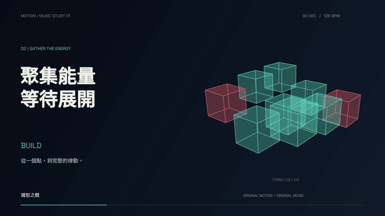

# EDM Music Production

An independent Codex skill for composing, arranging, synthesizing, mixing,
mastering, and revising original instrumental EDM.

獨立的 EDM 音樂製作 Skill，包含旋律與和聲、音色、編曲、混音、母帶與音訊檢查。
The instructions and production references are written in Traditional Chinese.

The included Melodic House starter produces music on its own. No video, logo,
fonts, renderer, or other skill is required. Change its composition and instruments
to fit each brief; the starter melody is a starting point.

## Original demo

[](https://bigtongue5566.github.io/edm-music-production/)

**[Watch Form & Frequency with sound →](https://bigtongue5566.github.io/edm-music-production/)**

An original 90-second motion-and-music study: 1080p, 128 BPM, D major,
procedural geometry, and a new synthesized Melodic House arrangement.

[Download the video](https://bigtongue5566.github.io/edm-music-production/media/form-and-frequency-90s.mp4) ·
[Hear the music](https://bigtongue5566.github.io/edm-music-production/media/form-and-frequency.m4a) ·
[Reproduce the project](examples/form-and-frequency/) ·
[Sources and licenses](examples/form-and-frequency/RIGHTS.md)

The animated preview above is an excerpt. The watch page plays the full film
with its soundtrack. The abstract visuals and music were created for this demo;
the typography uses documented OFL fonts. The source package and actual encoded
media checks are included in the example.

## Capabilities

- Configurable length, BPM, major/minor key, chord progression, and musical sections.
- Synthesized keys, pads, chord stabs, plucked leads, arpeggios, bass, drums, and transitions.
- Optional sampled piano with a local SoundFont and compatible FluidSynth.
- Kick-triggered ducking, frequency allocation, controlled note releases, and section contrast.
- A 48kHz/24-bit stereo WAV master, AAC soundtrack, editable MIDI, and optional aligned stems.
- Direct checks of both rendered formats: sample count, decoding, loudness, true peak,
  mono compatibility, unintended silence, and the final fade.
- Music and instrument provenance, including an optional SoundFont fingerprint.

## Install as a Codex skill

Clone into the standard Codex skills directory on Windows:

```powershell
git clone https://github.com/bigtongue5566/edm-music-production.git "$env:USERPROFILE\.codex\skills\edm-music-production"
```

If you configured a different `CODEX_HOME`, use its `skills/edm-music-production`
directory. Preserve an existing installation by choosing an empty destination.

Example invocation:

```text
用 $edm-music-production 製作一首 90 秒的旋律型 EDM，
有柔和鋼琴開場、兩段有力的高潮與自然收尾，交付音檔、MIDI 和分軌。
```

## Run the audio starter

Use Python 3.12 and `uv`. From the repository root:

```powershell
python -X utf8 scripts/init_project.py --project ../my-edm --duration 90 --bpm 120 --key "G major" --stems
uv venv ../my-edm/work/.venv --python 3.12
uv pip install --python ../my-edm/work/.venv/Scripts/python.exe -r ../my-edm/work/requirements.txt
```

Edit `../my-edm/project.json` for the title, length, tempo, key, chord degrees,
section timings, mastering targets, and instruments. Then:

```powershell
../my-edm/work/.venv/Scripts/python.exe -X utf8 ../my-edm/work/compose_edm.py --project ../my-edm
../my-edm/work/.venv/Scripts/python.exe -X utf8 ../my-edm/work/finish_music.py --project ../my-edm
```

On other platforms, use the corresponding `venv/bin/python` path. The audio
pipeline needs NumPy, SciPy, Mido, and imageio-ffmpeg. FFmpeg is provided by
imageio-ffmpeg; no system installation is required.

The initializer also accepts `--name` and `--slug`, validates settings before
writing, and refuses to overwrite existing files. Passing `--duration` scales
the default sections; edit their timing afterward for the desired musical form.

## Deliverables

| Output | Purpose |
| --- | --- |
| `<slug>-master.wav` | 48kHz/24-bit stereo master with the exact requested sample count |
| `<slug>.m4a` | AAC at 256kbps for convenient playback |
| `<slug>-music.mid` | Editable note and instrument tracks |
| `stems/<slug>-*.wav` | Optional aligned Float32 premaster stems |
| `<slug>-qc.json` | Measurements from the actual WAV and AAC |
| `<slug>-provenance.json` | Composition, instruments, sections, and source details |
| `<slug>-production.md` | Human-readable production notes |

The stems share gain and fades; summing them reconstructs `work/score-mix.wav`.
They are not separately normalized to loudness targets. The master undergoes
another loudness-processing stage. MIDI uses GM instrument suggestions and will
not reproduce the included synthesizers exactly.

## Keys and arrangement

The default progression is I–V–vi–IV in G major. Selecting a minor key in the
initializer uses i–VI–III–VII. Supported degrees and section behavior are in
[the project schema](references/music-project.md).

Sections use `intro`, `groove`, `build`, `drop`, `break`, and `outro`. The main
harmony follows bars; section accents and drum changes follow the requested
times. Align boundaries to bars when all instruments should change together,
or adapt the local phrase. An arbitrary duration is preserved with a tonic
resolution and fade. Loopable music requires a separate loop ending.

For sampled piano, configure local `music.soundfont` and `music.fluidsynth`
paths and record the sound library's source and license. No sampled bank or
external executable is bundled. Without a SoundFont, the keyboard is synthesized
and identified as such in the provenance.

## Production references

- [Skill instructions](SKILL.md)
- [Composition, sound design, and mixing](references/composition-and-mix.md)
- [Music project settings](references/music-project.md)
- [Local workflow and provenance](references/local-workflow.md)

This skill focuses on music. For branded video production, see the separate
[motion-graphics-video](https://github.com/bigtongue5566/motion-graphics-video) skill.

## Verification

Run the included end-to-end smoke tests after installing the audio dependencies:

```powershell
../my-edm/work/.venv/Scripts/python.exe -X utf8 -m unittest discover -s tests -v
```

They render a non-bar-length minor-key track, verify MIDI and audio output,
check stem recombination and deterministic rendering, and exercise the
initializer's rejection of invalid settings and existing files.

Signal checks and symbolic chord audits do not prove that music sounds good.
Listen to the arrangement, transitions, instrument balance, and ending to
assess musical quality. The default master targets are −16 LUFS and −2 dBTP;
choose suitable targets for the actual use.

## License

The skill documentation, original composition template, and synthesis code are
available under the [MIT License](LICENSE).
The synthesis primitives were originally released as part of
[motion-graphics-video](https://github.com/bigtongue5566/motion-graphics-video).
Dependencies, SoundFonts, instrument samples, and other external assets retain
their respective licenses. No sampled instrument banks or third-party songs are bundled.
